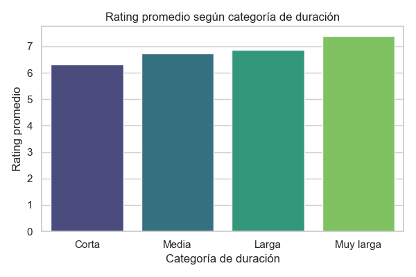

# Analisis acerca de las peliculas ¿Acaso las películas más largas tienen mejor rating?

## Descripción
En este proyecto buscamos ver si existe una relación entre la duración de las películas y su calificación promedio. Utilice un conjunto de datos ficticio con películas de diferentes géneros y años, incluyendo información como duración, rating y año de estreno.

## Objetivos
- Investigar si las películas más largas tienden a tener mejores calificaciones.
- Visualizar la distribución de duración y calificaciones.
- Analizar cómo cambian estas métricas según el género o la década.

## Herramientas utilizadas
- Python
- Pandas
- Matplotlib
- Seaborn
- Jupyter Notebook / VS Code

## Análisis realizado
- Histograma de duración de películas
- Histograma de calificaciones
- Gráfico de dispersión: duración vs. calificación
- Promedio de calificación por duración agrupada
- Análisis por género y año de estreno

## Dataset
El dataset fue generado sintéticamente e incluye:
- title: Título de la película
- year: Año de estreno
- duration_minutes: Duración en minutos
- rating: Calificación (escala de 1 a 10)
- genre: Género principal

## Conclusiones (ejemplo)
- Existe una *ligera tendencia* a que películas más largas tengan mejores calificaciones.
- Los géneros como *Drama* y *Documentary* presentan mayor duración promedio.
- Las películas estrenadas después del 2010 tienden a tener duraciones más variadas.

## Ejemplo de grafico generado

---

Creado por [henryydata](https://github.com/henryydata)
